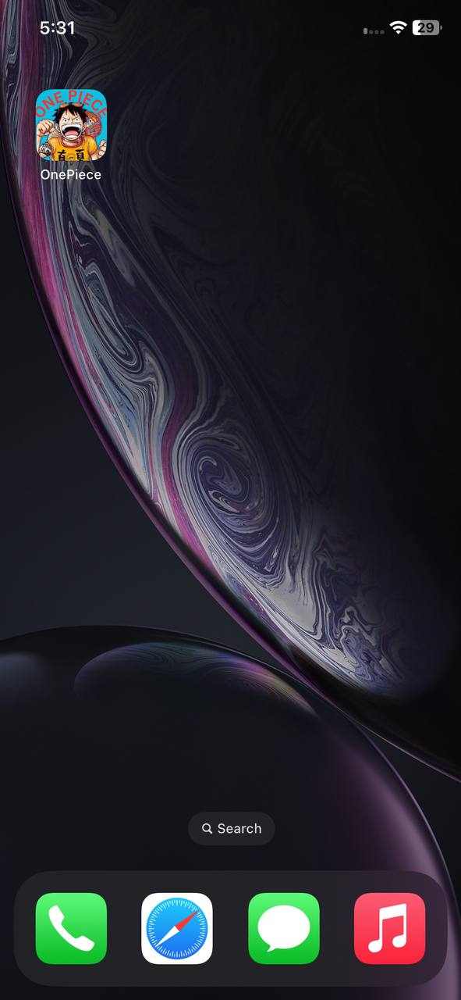
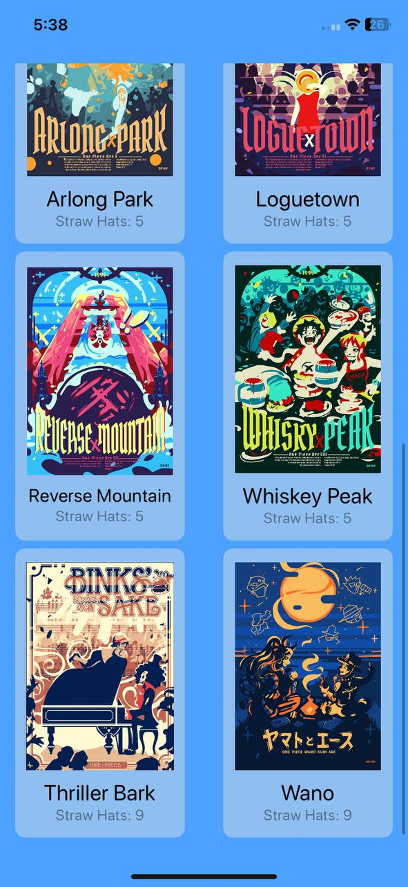
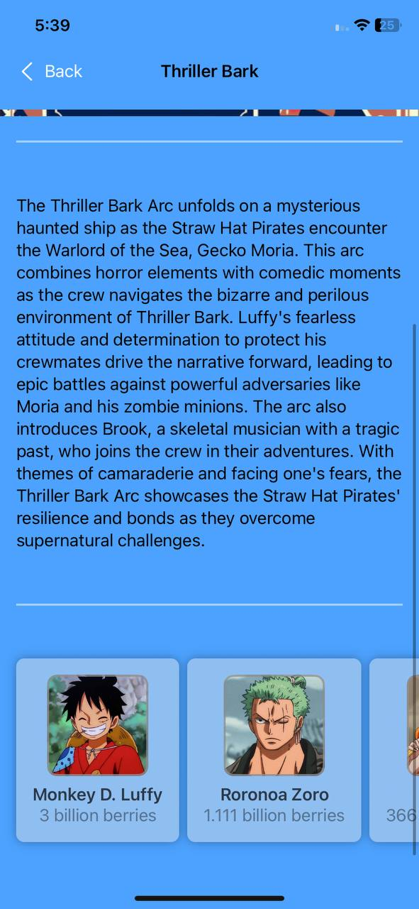
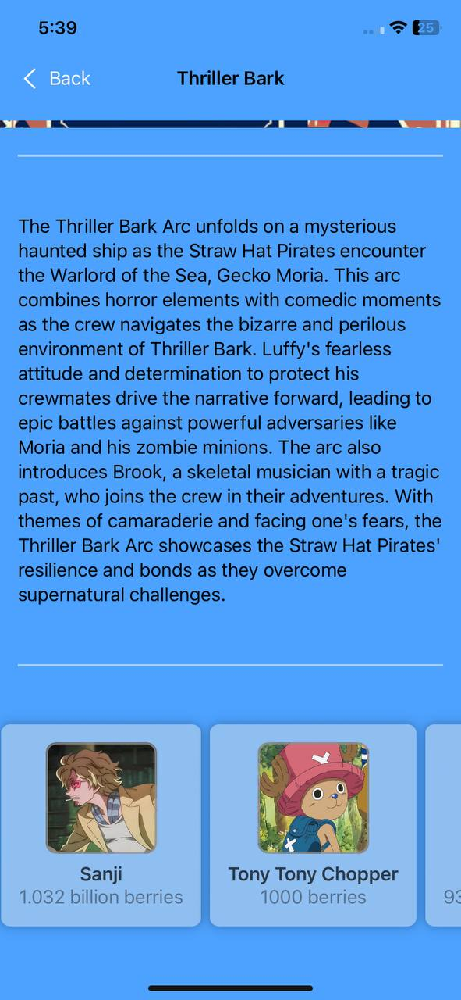

<h1 align="center">🏴‍☠️ OnePiece - iOS App</h1>

**OnePiece** is a fan-made iOS app that brings the world of **One Piece** to your fingertips. Designed for anime enthusiasts, this app provides detailed information about all major story arcs in the series and the iconic characters from the **Straw Hat Crew**. Whether you’re a long-time fan or just getting started, OnePiece makes it easy to explore the epic saga.

---

## ✨ Features:

- 📚 **One Piece Arc Guide**  
  Browse through all the major story arcs in the One Piece anime. Each arc includes summaries and key highlights.

- 🧑‍✈️ **Straw Hat Crew Information**  
  View detailed profiles of each Straw Hat crew member, including their background and role in the crew.

- 💖 **Mark Your Favorite Arcs**  
  Select your favorite arcs to keep track of the stories you love most.

- 📦 **Offline Support with Local JSON**  
  All data is stored in local JSON files bundled with the app — no internet connection needed.

- 🌈 **Modern SwiftUI Interface**  
  Built entirely with **SwiftUI** for a clean, smooth, and responsive user experience.

---

## 🛠️ Installation:

To run this project locally:

1. Clone the repository:
    ```bash
    git clone https://github.com/deepanshubajaj/OnePiece-iOSApp.git
    ```

2. Open the project in Xcode:
    ```bash
    open OnePiece.xcodeproj
    ```

3. Build and run the app on a simulator or physical device.

> Make sure you have Xcode installed and configured properly to run the project.

---

## 🛠 Technologies Used:

- 🛠️ **SwiftUI** — Used for designing the user interface.
- 📂 **Local JSON Files** — `Arcs.json`, `Characters.json`, and `savedArcs.json` power the app's data.
- 🧪 **Xcode** — Used for development, testing, and debugging.

---

## ⚙️ Data Reference:

📂 **Local JSON Files** — `Arcs.json`, `Characters.json`, and `savedArcs.json` power the app's data.

---

## 🎨 App Look:

<p align="center">
  
</p>
<p align="center">
  *App snapshot in the simulator.*
</p>

---

## 🖼️ Screenshots:

<p align="center">
  
</p>

<p align="center">
  
  
  
</p>

<p align="center">
  *Splash screen displayed upon app launch.*
</p>


##


<p align="center">
    
    
    
</p>

##

<p align="center">
    
    
    
</p>

##

<p align="center">
    
    
    
</p>

##

<p align="center">
    
    
    
</p>

##

<p align="center">
    
    
    
</p>

##

<p align="center">
    
    
    
</p>

##

<p align="center">
    
    
    
</p>

##

<p align="center">
    
    
    
</p>

##

<p align="center">
    
    
    
</p>

##

<p align="center">
    
    
    
</p>

##

<p align="center">
    
    
    
</p>

<p align="center">
  *Screenshots of the OnePiece App showing different screens*
</p>

---

## 📱 App Icon:

<p align="center">
  
</p>
<p align="center">
  *The app icon reflects the OnePiece look*
</p>

---

## 🚀 Video Demo:

Here’s a short video showcasing the app's functionality:

<p align="center">
  
</p>

➤ <a href="ProjectOutputs/WorkingVideo/splashScreenVideo.MOV">🎬 Watch Splash Screen Video</a>

➤ <a href="ProjectOutputs/WorkingVideo/workingVideo.MP4">🎥 Watch Working Video</a>

---

## 🤝 Contributing

Thank you for your interest in contributing to this project!  
I welcome contributions from the community.

- You are free to use, modify, and redistribute this code under the terms of the **Apache-2.0 License**.
- If you'd like to contribute, please **open an issue** or **submit a pull request**.
- All contributions will be reviewed and approved by the author — **[Deepanshu Bajaj](https://github.com/deepanshubajaj?tab=overview&from=2025-03-01&to=2025-03-31)**.

---

## 📃 License

This project is licensed under the [Apache-2.0 License](./LICENSE).  
You are free to use this project for personal, educational, or commercial purposes — just make sure to provide proper attribution.

> **Clarification:** Commercial use includes, but is not limited to, use in products,  
> services, or activities intended to generate revenue, directly or indirectly.
